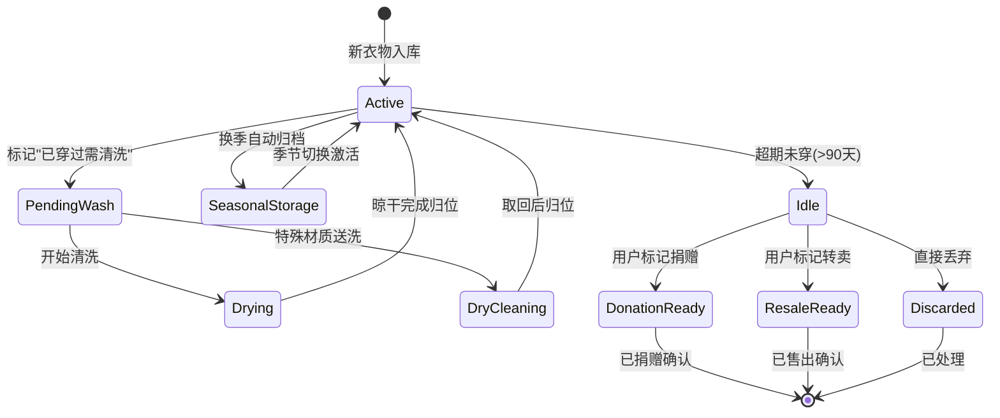

# SmartWardrobe v4.0 - 衣物生命周期管理版本

## 版本概述
**发布日期**: 2026-Q4
**开发周期**: 10周
**基于版本**: v3.0（完全兼容）
**目标**: 实现衣物从入库到淘汰的全生命周期智能化管理

## 一、版本定位与理念升华

### 从"拥有"到"管理"的范式转变
```
v3.0: 智能推荐 → 帮你决定穿什么
         ↓ 闭环延伸
v4.0: 生命周期管理 → 帮你管理衣橱健康度
```

### 核心理念：极简主义衣橱哲学
- **一进一出原则**: 控制总量，避免无限膨胀
- **断舍离指数**: 量化闲置程度，推动决策
- **胶囊衣橱生成**: 精简至30件核心单品，提升效率
- **碳足迹追踪**: 可持续时尚意识培养

### 用户价值提升
✅ **告别混乱**: 衣物状态一目了然（在穿/待洗/收纳/闲置）
✅ **主动提醒**: 洗护/换季/断舍离，系统主动推动行动
✅ **数据洞察**: 了解自己的穿衣习惯，优化消费决策
✅ **环保贡献**: 通过转卖/捐赠减少浪费

## 二、核心功能模块详解

### 2.1 🔄 衣物状态机设计（P0优先级）

#### 状态流转图



#### 状态定义与业务规则

| 状态 | 中文名 | 触发条件 | 允许的操作 |
|------|--------|---------|-----------|
| `active` | 活跃可穿 | 默认状态 / 从其他状态恢复 | 穿着、试衣、编辑、收藏 |
| `pending_wash` | 待清洗 | 手动标记或穿着次数达阈值 | 开始清洗、取消标记 |
| `drying` | 待晾晒 | 清洗操作触发 | 标记晾干完成 |
| `dry_cleaning` | 干洗中 | 送洗操作触发 | 标记取回 |
| `seasonal_storage` | 换季收纳 | 系统/手动换季归档 | 激活、查看详情 |
| `idle` | 闲置待处理 | 连续X天未穿 + 系统判定 | 捐赠、转卖、重新激活、丢弃 |
| `donation_ready` | 待捐赠 | 用户主动标记 | 确认捐赠、取消 |
| `resale_ready` | 待转卖 | 用户主动标记 | 上架二手平台、取消 |
| `discarded` | 已废弃 | 用户确认丢弃 | 仅查看历史 |

**状态转换约束示例**:
```python
# services/lifecycle/state_machine.py
class ClothingStateMachine:
    VALID_TRANSITIONS = {
        'active': ['pending_wash', 'seasonal_storage', 'idle', 'discarded'],
        'pending_wash': ['drying', 'dry_cleaning', 'active'],  # 可取消
        'drying': ['active'],  # 只能回到活跃状态
        'seasonal_storage': ['active'],  # 等待季节切换
        'idle': ['active', 'donation_ready', 'resale_ready', 'discarded'],
        # 终态不可逆
        'donation_ready': [],  # 需确认后才真正移除
        'resale_ready': [],
        'discarded': []
    }

    def transition(self, clothing_id: str, target_state: str, reason: str = None):
        current_state = self.get_current_state(clothing_id)

        if target_state not in self.VALID_TRANSITIONS[current_state]:
            raise InvalidTransitionError(
                f"Cannot transition from {current_state} to {target_state}"
            )

        # 执行业务逻辑
        if target_state == 'idle':
            self._trigger_idle_analysis(clothing_id)  # 分析闲置原因
        elif target_state == 'seasonal_storage':
            self._generate_storage_checklist(clothing_id)  # 生成收纳建议

        # 记录状态变更日志
        self.log_state_change(clothing_id, current_state, target_state, reason)
```

### 2.2 🧺 智能洗护管理系统（P0优先级）

#### 功能架构

```typescript
// services/care/care_manager.ts
interface CareRule {
  material_type: string;          // 材质类型
  wash_method: 'machine' | 'hand' | 'dry_clean_only';
  water_temp: 'cold' | 'warm' | 'hot';
  bleach_allowed: boolean;
  tumble_dry: boolean;
  iron_temp?: 'low' | 'medium' | 'high';
  special_instructions: string[]; // ["不可拧绞","阴凉处晾干"]
  frequency_recommendation: {
    max_wears_before_wash: number;  // 最多穿几次后必须洗
    ideal_wash_interval_days: number; // 建议洗涤周期
  };
}

const CARE_RULES_DATABASE: Record<string, CareRule> = {
  'cotton': {
    wash_method: 'machine',
    water_temp: 'warm',
    max_wears_before_wash: 3,
    special_instructions: ["与深色衣物分开洗涤"]
  },
  'wool': {
    wash_method: 'dry_clean_only',
    special_instructions: ["不可机洗","不可漂白","平铺晾干"],
    max_wears_before_wash: 5  // 羊毛不需要频繁清洗
  },
  'silk': {
    wash_method: 'hand',
    water_temp: 'cold',
    tumble_dry: false,
    special_instructions: ["使用专用丝毛洗涤剂","轻柔手搓"]
  },
  'denim': {
    wash_method: 'machine',
    water_temp: 'cold',
    max_wears_before_wash: 5,
    special_instructions: ["翻面洗涤","减少褪色"]
  }
  // ... 更多材质规则
};
```

#### 洗护提醒引擎

```python
# services/care/remind_engine.py
class CareReminderEngine:
    def __init__(self):
        self.scheduler = APScheduler()
        self.notification_service = NotificationService()

    def calculate_next_care_date(self, clothing_id: str) -> date:
        """计算下次需要护理的日期"""
        clothing = db.get_clothing(clothing_id)
        last_wear_date = clothing.last_worn_date
        wear_count_since_last_wash = clothing.wear_count_since_wash

        care_rule = CARE_RULES_DATABASE[clothing.material.primary]

        # 策略1: 基于穿着次数
        if wear_count_since_last_wash >= care_rule.frequency.max_wears_before_wash:
            return date.today()  # 今天就该洗了

        # 策略2: 基于时间间隔（防止长期不穿但该清洗的情况）
        days_since_last_wash = (date.today() - clothing.last_wash_date).days
        if days_since_last_wash > care_rule.frequency.ideal_wash_interval_days * 1.5:
            return date.today() + timedelta(days=3)  # 给3天缓冲期

        # 正常情况：预估下次日期
        remaining_wears = care_rule.frequency.max_wears_before_wash - wear_count_since_last_wash
        avg_wears_per_week = self.calculate_avg_wear_frequency(clothing_id)
        estimated_days = (remaining_wears / avg_wears_per_week) * 7 if avg_wears_per_week > 0 else 30

        return date.today() + timedelta(days=estimated_days)

    async def generate_daily_reminders(self, user_id: str):
        """每日扫描生成提醒任务"""
        active_clothes = db.query("""
            SELECT c.id, c.material, c.wear_count_since_wash, c.last_wash_date
            FROM clothes c
            WHERE c.user_id = $1 AND c.status = 'active'
        """, user_id)

        reminders = []
        for clothing in active_clothes:
            next_care_date = self.calculate_next_care_date(clothing.id)
            days_until_care = (next_care_date - date.today()).days

            if days_until_care <= 3:  # 未来3天内需要护理
                reminders.append({
                    'clothing_id': clothing.id,
                    'type': 'wash_needed' if days_until_care <= 0 else 'upcoming_care',
                    'urgency': 'high' if days_until_care <= 0 else 'medium',
                    'message': self.generate_reminder_message(clothing, days_until_care),
                    'suggested_action': self.get_suggested_action(clothing),
                    'due_date': next_care_date.isoformat()
                })

        # 批量发送通知
        await self.notification_service.send_batch(user_id, reminders)
```

#### 洗护记录API

```typescript
// POST /api/v4/care/log-wash
interface WashLogRequest {
  clothing_ids: string[];           // 支持批量记录（一次洗多件）
  wash_date: string;                // ISO 8601
  wash_method: 'machine' | 'hand_wash' | 'dry_clean';
  detergent_used?: string;          // 洗涤剂类型
  notes?: string;                   // "发现轻微掉色"
  before_photo?: string;            // 洗前照片（可选）
  after_photo?: string;             // 洗后照片（可选）
}

// GET /api/v4/care/reminders
interface CareRemindersResponse {
  urgent: Array<{
    clothing_id: string;
    name: string;
    image_url: string;
    reason: string;                 // "已连续穿着4次"
    overdue_days: number;           // 逾期天数
    suggested_action: string;       // "建议立即清洗"
    care_instructions: CareRule;    // 详细护理指南
  }>;
  upcoming: Array<{ ... }>;         // 未来3-7天内需要护理的
  seasonal_alerts: Array<{          // 换季相关
    type: 'store_winter_clothes' | 'retrieve_summer_clothes';
    affected_items_count: number;
    weather_forecast: string;       // "下周降温至15°C"
  }>;
}
```

### 2.3 📦 换季智能收纳系统（P0优先级）

#### 自动化换季逻辑

```python
# services/seasonal/manager.py
class SeasonalManager:
    SEASON_DEFINITION = {
        'spring': {'months': [3, 4, 5], 'temp_range': (10, 22)},
        'summer': {'months': [6, 7, 8], 'temp_range': (25, 38)},
        'autumn': {'months': [9, 10, 11], 'temp_range': (10, 22)},
        'winter': {'months': [12, 1, 2], 'temp_range': (-10, 12)}
    }

    def detect_season_transition(self, user_city: str) -> SeasonTransition:
        """
        基于气象数据+历史规律判断是否到了换季时间
        """
        weather_data = await weather_api.get_14_day_forecast(user_city)
        current_season = self.get_current_season()
        avg_temp_next_7_days = np.mean([d.temp for d in weather_data[:7]])

        # 判断是否跨季节阈值
        for season, config in self.SEASON_DEFINITION.items():
            if season != current_season:
                if config['temp_range'][0] <= avg_temp_next_7_days <= config['temp_range'][1]:
                    return SeasonTransition(
                        from_season=current_season,
                        to_season=season,
                        confidence=0.9,
                        trigger_reason=f"未来7天均温{avg_temp_next_7_days}°C，进入{season}温度区间",
                        recommended_action_date=date.today() + timedelta(days=3)
                    )

        return None  # 无需换季

    async def generate_seasonal_transition_plan(self, user_id: str):
        """生成完整的换季执行计划"""
        transition = await self.detect_season_transition(await self.get_user_city(user_id))
        if not transition:
            return None

        # Step 1: 识别需要收纳的过季衣物
        to_store = db.query("""
            SELECT * FROM clothes
            WHERE user_id = $1
              AND status = 'active'
              AND $2 <@ seasons  -- 当前衣物适用季节包含即将结束的季节
              AND NOT ($3 = ANY(seasons))  -- 不适用于即将到来的季节
        """, user_id, transition.from_season, transition.to_season)

        # Step 2: 识别需要取出的当季衣物
        to_retrieve = db.query("""
            SELECT * FROM clothes
            WHERE user_id = $1
              AND status = 'seasonal_storage'
              AND $2 = ANY(seasons)
        """, user_id, transition.to_season)

        return TransitionPlan(
            transition=transition,
            items_to_store=self._prioritize_storage(to_store),  # 按使用频率排序
            items_to_retrieve=to_retrieve,
            storage_checklist=self._generate_checklist(to_store),
            retrieval_checklist=self._generate_checklist(to_retrieve, mode='retrieve'),
            tips=self._get_seasonal_tips(transition.to_season)
        )
```

#### 收纳清单与指导

```typescript
interface TransitionPlan {
  transition: {
    from: 'summer';
    to: 'autumn';
    date: '2026-09-15';
    reason: '未来7天均温降至18°C';
  };

  items_to_store: Array<{
    clothing_id: string;
    name: string;
    category: string;
    last_worn_date: string;        // 最后穿着日期
    times_worn_this_season: number; // 本季穿着次数
    storage_priority: 'high' | 'medium' | 'low'; // 高频穿的晚点收
    care_before_storage: string;   // "收纳前请确保已清洗干净"
  }>;

  storage_checklist: Array<{
    step: number;
    task: string;
    completed: boolean;
    tip?: string;
  }>;
  // 示例:
  // [
  //   {step: 1, task: "清洗所有待收纳衣物", tip: "特别注意白色衣物去污"},
  //   {step: 2, task: "准备防尘袋与干燥剂"},
  //   {step: 3, task: "按品类分类折叠/悬挂"},
  //   {step: 4, task: "放入防虫剂（天然樟脑丸）"},
  //   {step: 5, task: "拍照记录收纳位置（可选）"}
  // ]

  seasonal_tips: [
    "秋季早晚温差大，建议准备一件轻薄外套",
    "层叠穿搭法：T恤+衬衫+外套，方便随时脱减",
    "检查风衣/夹克的防水涂层是否完好"
  ];
}
```

### 2.4 ♻️ 断舍离与闲置处置闭环（P1优先级）

#### 闲置检测算法

```python
# services/idle/detector.py
class IdleClothingDetector:
    def analyze_idle_status(self, clothing_id: str) -> IdleAnalysis:
        clothing = db.get_clothing(clothing_id)
        today = date.today()

        # 维度1: 时间维度 - 未穿着天数
        days_not_worn = (today - clothing.last_worn_date).days

        # 维度2: 频率维度 - 近90天穿着次数
        recent_wear_count = db.query_scalar("""
            SELECT COUNT(*) FROM outfit_wear_logs
            WHERE clothing_id = $1
              AND wear_date >= NOW() - INTERVAL '90 days'
        """, clothing_id)

        # 维度3: 趋势维度 - 穿着频率是否下降
        wear_frequency_trend = self.calculate_trend(
            clothing_id,
            windows=[30, 60, 90]  # 对比近30/60/90天的频率
        )

        # 维度4: 季节性因素排除
        is_currently_in_season = self.is_in_current_season(clothing.seasons)

        # 综合评分 (0-100, 越高越应该闲置处置)
        idle_score = self._calculate_idle_score({
            'days_not_worn': days_not_worn,
            'recent_wear_count': recent_wear_count,
            'frequency_trend': wear_frequency_trend,
            'is_in_season': is_currently_in_season,
            'purchase_price': clothing.price,
            'age_months': (today - clothing.purchase_date).days / 30
        })

        # 生成处置建议
        if idle_score > 80 and clothing.price > 500:
            suggestion = 'resale_high_value'  # 高价值物品建议转卖
        elif idle_score > 70:
            suggestion = 'donate'  # 中等价值建议捐赠
        elif idle_score > 50:
            suggestion = 'reconsider'  # 边缘物品给用户思考期
        else:
            suggestion = 'keep'

        return IdleAnalysis(
            idle_score=idle_score,
            idle_level: self._score_to_level(idle_score),  # critical/high/medium/low
            days_not_worn=days_not_worn,
            last_worn_date=clothing.last_worn_date,
            reason=self._generate_explanation(idle_score, clothing),
            suggested_action=suggestion,
            potential_resale_price=self._estimate_resale_price(clothing),  # 基于品相估算
            environmental_impact=f"若转卖可减少约{clothing.weight_kg * 23}kg碳排放"
        )
```

#### 一进一出强制策略（Pro版功能）

```typescript
// middleware/one_in_one_out.ts
export class OneInOneOutEnforcer {
  async checkBeforeAddNewItem(userId: string, newItemCount: number = 1): Promise<EnforcementResult> {
    const userSettings = await this.getUserSettings(userId);
    if (!userSettings.enable_one_in_one_out) {
      return { allowed: true }; // 未启用则放行
    }

    const currentActiveCount = await this.countActiveItems(userId);
    const maxCapacity = userSettings.wardrobe_capacity_limit || 200;

    if (currentActiveCount + newItemCount > maxCapacity) {
      // 超出容量，强制要求选择移出物品
      const candidatesForRemoval = await this.getIdleCandidates(userId, count=newItemCount);

      return {
        allowed: false,
        reason: 'WARDROBE_FULL',
        message: `您的衣橱已达上限(${maxCapacity}件)，请先选择${newItemCount}件物品移出`,
        required_actions: [{
          type: 'select_items_to_remove',
          count: newItemCount,
          suggested_candidates: candidatesForRemoval.map(item => ({
            id: item.id,
            name: item.name,
            image_url: item.image_url,
            idle_score: item.idle_score,
            reason: `已${item.days_not_worn}天未穿`
          }))
        }]
      };
    }

    return { allowed: true };
  }

  async executeSwap(userId: string, newItems: string[], removedItems: string[]): Promise<void> {
    // 原子操作：同时添加新物品并标记旧物品为闲置
    await db.transaction(async (tx) => {
      // 添加新物品
      for (const itemId of newItems) {
        await tx.updateStatus(itemId, 'active');
      }
      // 移除旧物品
      for (const itemId of removedItems) {
        await tx.transitionState(itemId, 'idle', '一进一出策略强制移出');
      }
      // 记录交换日志
      await tx.logSwap(userId, newItems, removedItems);
    });
  }
}
```

#### 二手转卖对接（集成闲鱼/转转API）

```typescript
// POST /api/v4/resale/list-item
interface ResaleListingRequest {
  clothing_id: string;
  platform: 'xianyu' | 'zhuanzhuan' | 'generic';  // 目标平台
  pricing_strategy: 'auto' | 'manual';
  price?: number;  // manual模式时必填

  listing_details: {
    title?: string;  // 不填则AI自动生成吸引人的标题
    description?: string;  // AI根据衣物属性生成卖点文案
    condition_level: 'like_new' | 'good' | 'fair';  // 成色自评
    original_purchase_price?: number;  // 原价（用于展示折扣力度）
    defects?: string[];  // 瑕疵描述
    include_original_photos: boolean;  // 是否使用AI抠图后的精美图
  };

  shipping_options: {
    method: 'free_shipping' | 'buyer_pays' | 'meet_up';
    location?: string;  // 同城交易地点
  };
}

interface ResaleListingResponse {
  listing_id: string;  // 平台商品ID
  platform_url: string;  // 商品链接
  status: 'published' | 'pending_review';
  ai_generated_content: {
    title: string;  // "【几乎全新】ZARA黑色羊毛大衣 M码 仅试穿"
    description: string;  # 营销文案
    suggested_price_range: { min: number; max: number; recommended: number };
    tags: string[];
  };
  analytics_preview: {
    estimated_views_per_day: number;  # 基于同类目数据预测
    estimated_sale_probability: number;  # 7天内售出概率
  };
}
```

### 2.5 📊 衣橱健康度诊断报告（P1优先级）

#### 多维度诊断体系

```typescript
// GET /api/v4/analytics/wardrobe-health
interface WardrobeHealthReport {
  report_date: string;
  reporting_period: 'last_30_days' | 'last_quarter' | 'this_year';

  overview: {
    total_items: number;
    active_items: number;
    idle_items_rate: number;        // 闲置率 %
    average_cost_per_wear: number;  // 每次穿着成本（元）
    wardrobe_utilization: number;   // 衣橱利用率 0-100%
    health_score: number;           // 综合健康评分 0-100
    grade: 'A+' | 'A' | 'B' | 'C' | 'D' | 'F';
  };

  dimension_analyses: {
    variety: {
      score: number;
      categories_coverage: Map<string, number>;  // 各品类数量分布
      warning: string | null;  // "上衣占比过高(60%)，建议补充下装多样性"
      suggestion: string;
    };

    color_balance: {
      score: number;
      dominant_colors: Array<{ color: hex; percentage: number; name: string }>;
      missing_colors?: string[];  // 缺少的百搭色
      suggestion: string;
    };

    financial_health: {
      total_investment: number;     // 总投入金额
      cost_efficiency_ranking: string;  // "高于85%的用户"
      overspend_categories: Array<{
        category: string;
        total_spent: number;
        avg_cost_per_item: number;
        wear_frequency: number;
        roi_verdict: 'good' | 'overpriced' | 'underutilized';
      }>;
    };

    sustainability: {
      carbon_footprint_kg: number;  // 碳足迹估算
      items_donated_count: number;
      items_resold_count: number;
      fast_fashion_ratio: number;   // 快时尚占比（高=不环保）
      eco_tip: string;
    };

    fit_and_comfort: {
      highly_rated_items: number;   // 高评分单品数
      uncomfortable_items: Array<{
        id: string;
        name: string;
        issue: string;  // "偏小"、"面料刺痒"
        last_worn: string;
      }>;
    };
  };

  action_items: Array<{
    priority: 'critical' | 'high' | 'medium' | 'low';
    category: 'declutter' | 'purchase_guidance' | 'care' | 'organization';
    title: string;
    description: string;
    affected_items_count: number;
    estimated_impact: string;  // "预计释放20%物理空间"
    quick_action_link: string;  // 跳转到对应功能的深度链接
  }>;

  trends: {
    month_over_month: {
      utilization_trend: 'improving' | 'stable' | 'declining';
      new_additions_vs_removals: { added: number; removed: number };
      most_worn_category: string;
      least_worn_category: string;
    };
  };
}
```

## 三、新增数据库表（v4.0增量）

```sql
-- 衣物状态变更日志表（审计追踪）
CREATE TABLE clothing_status_logs (
    id BIGSERIAL PRIMARY KEY,
    clothing_id UUID REFERENCES clothes(id) ON DELETE CASCADE,
    user_id UUID REFERENCES users(id),
    from_status VARCHAR(20),
    to_status VARCHAR(20) NOT NULL,
    reason TEXT,
    triggered_by VARCHAR(50), -- 'user_manual'|'system_auto'|'care_reminder'|'one_in_one_out'
    created_at TIMESTAMPTZ DEFAULT NOW()
);
CREATE INDEX idx_status_logs_clothing_time ON clothing_status_logs(clothing_id, created_at DESC);

-- 洗护记录表
CREATE TABLE care_logs (
    id UUID PRIMARY KEY DEFAULT gen_random_uuid(),
    clothing_id UUID REFERENCES clothes(id) ON DELETE CASCADE,
    user_id UUID REFERENCES users(id),
    care_type VARCHAR(30) NOT NULL, -- wash/dry_clean/iron/repair/stain_removal
    care_date DATE NOT NULL,
    method_details JSONB, -- {"water_temp":"warm","detergent":"eco_friendly"}
    notes TEXT,
    before_image_url TEXT,
    after_image_url TEXT,
    cost DECIMAL(10,2), -- 干洗费用等
    created_at TIMESTAMPTZ DEFAULT NOW()
);

-- 换季操作记录表
CREATE TABLE seasonal_operations (
    id UUID PRIMARY KEY DEFAULT gen_random_uuid(),
    user_id UUID REFERENCES users(id),
    operation_type VARCHAR(20) NOT NULL, -- 'storage'|'retrieval'
    season VARCHAR(10) NOT NULL,
    operation_date DATE NOT NULL,
    items_count INTEGER NOT NULL,
    item_ids UUID[],
    checklist_completed BOOLEAN DEFAULT false,
    notes TEXT,
    created_at TIMESTAMPTZ DEFAULT NOW()
);

-- 闲置分析快照表（定期生成）
CREATE TABLE idle_analysis_snapshots (
    id UUID PRIMARY KEY DEFAULT gen_random_uuid(),
    user_id UUID REFERENCES users(id),
    analysis_date DATE NOT NULL,
    total_active INTEGER,
    idle_count INTEGER,
    idle_rate DECIMAL(5,2),
    high_priority_idle_ids UUID[],  -- idle_score > 80 的衣物ID
    avg_idle_days NUMERIC,
    created_at TIMESTAMPTZ DEFAULT NOW()
);

-- 二手转卖记录表
CREATE TABLE resale_listings (
    id UUID PRIMARY KEY DEFAULT gen_random_uuid(),
    clothing_id UUID REFERENCES clothes(id) ON DELETE CASCADE,
    user_id UUID REFERENCES users(id),
    platform VARCHAR(30),
    platform_listing_id VARCHAR(100),  -- 外部平台ID
    listing_url TEXT,
    listed_price DECIMAL(10,2),
    original_price DECIMAL(10,2),
    status VARCHAR(20) DEFAULT 'listed', -- listed/sold/expired/cancelled
    sold_date DATE,
    sold_price DECIMAL(10,2),
    buyer_feedback TEXT,
    created_at TIMESTAMPTZ DEFAULT NOW(),
    updated_at TIMESTAMPTZ DEFAULT NOW()
);

-- 衣橱健康报告存档表
CREATE TABLE wardrobe_health_reports (
    id UUID PRIMARY KEY DEFAULT gen_random_uuid(),
    user_id UUID REFERENCES users(id),
    report_period VARCHAR(20),
    report_data JSONB NOT NULL,  -- 完整的报告JSON
    generated_at TIMESTAMPTZ DEFAULT NOW()
);
```

## 四、定时任务与自动化流程

### 4.1 Cron Job调度清单

```yaml
# config/cron_jobs.yaml
jobs:
  # === 每日任务 ===
  - name: daily_care_reminder_check
    schedule: "0 8 * * *"  # 每天早上8点
    handler: services.care.remind_engine.generate_daily_reminders
    description: 扫描所有用户，生成当日洗护提醒

  - name: daily_idle_detection_scan
    schedule: "0 9 * * *"
    handler: services.idle.detector.batch_scan_users
    description: 检测新增闲置物品并推送通知

  # === 每周任务 ===
  - name: weekly_wardrobe_health_snapshot
    schedule: "0 10 * * 1"  # 每周一上午10点
    handler: services.analytics.generate_health_snapshot
    description: 生成衣橱健康快照用于趋势分析

  - name: weekly_resale_price_update
    schedule: "0 11 * * 5"  # 每周五（为周末二手交易高峰做准备）
    handler: services.resale.update_market_prices
    description: 更新二手市场价格参考数据

  # === 季节性任务 ===
  - name: seasonal_transition_monitor
    schedule: "0 8 * * *"  # 每日检查（仅在过渡期活跃时高频运行）
    handler: services.seasonal.manager.check_transition_conditions
    description: 监控气温变化，提前7天预警换季

  - name: monthly_subscription_billing
    schedule: "0 0 1 * *"
    handler: services.billing.process_subscriptions
    description: 月度订阅计费（Pro版功能）

  # === 用户行为触发（非定时，事件驱动）===
  event_driven:
    - event: clothing.worn_logged
      handler: services.care.update_wear_count_and_check_threshold
      debounce_seconds: 300  # 5分钟内多次穿着只处理一次

    - event: clothing.status_changed.to_idle
      handler: services.idle.generate_disposal_suggestions
```

## 五、前端页面扩展

### 5.1 衣橱仪表盘（Dashboard首页改版）

```
路由: /dashboard
布局:
┌──────────────────────────────────────────────┐
│  顶部统计卡片行                              │
│  [总件数:156] [活跃:142] [待洗:3] [闲置:11] │
├──────────┬───────────────────────────────────┤
│          │                                   │
│  快捷操作 │  今日概览                          │
│  面板    │  ┌─────────────────────────────┐  │
│          │  │ 🌤 天气 + OOTD推荐卡片       │  │
│ [录入新衣]│  │ ⚠️ 3件衣物待清洗             │  │
│ [一键换季]│  │ 📦 下周将降温，建议准备外套   │  │
│ [生成报告]│  │ ♻️ 5件闲置超90天             │  │
│ [断舍离]  │  └─────────────────────────────┘  │
│          │                                   │
│          │  最近动态Timeline                  │
│          │  ├─ 昨天: 穿了ZARA牛仔裤           │
│          │  ├─ 3天前: UNIQLO卫衣入库          │
│          │  └─ 1周前: 羊绒大衣送干洗          │
├──────────┴───────────────────────────────────┤
│  底部: 衣橱健康度进度条                       │
│  ████████░░░░ 82/100 (B+)                    │
└──────────────────────────────────────────────┘
```

### 5.2 闲置物品处理向导

```tsx
// pages/IdleItemWizard.tsx
function IdleItemWizard() {
  const steps = ['review', 'decide', 'execute', 'confirm'];

  return (
    <MultiStepWizard steps={steps}>
      <StepReview>
        {/* 展示闲置物品列表，按idle_score排序 */}
        <IdleItemList />
        <StatisticsBanner
          totalIdleValue="¥12,580"
          potentialSpaceSaved="2个抽屉"
          environmentalImpact="减少186kg碳排放"
        />
      </StepReview>

      <StepDecide>
        {/* 为每件物品选择处置方式 */}
        {idleItems.map(item => (
          <DisposalOptionCard
            item={item}
            options={['keep_try_harder', 'donate', 'resale', 'discard']}
            onResaleClick={() => openResaleDialog(item)}
            aiSuggestion={item.suggested_action}
          />
        ))}
      </StepDecide>

      <StepExecute>
        {/* 批量执行操作 */}
        {selectedForResale.length > 0 && (
          <BulkResaleForm items={selectedForResale} />
        )}
        {selectedForDonation.length > 0 && (
          <DonationCertificateGenerator items={selectedForDonation} />
        )}
      </StepExecute>

      <StepConfirm>
        {/* 操作确认与反馈收集 */}
        <ConfirmationSummary />
        <FeedbackForm question="这次断舍离体验如何？" />
      </StepConfirm>
    </MultiStepWizard>
  );
}
```

## 六、版本验收标准

### Must Have
- [ ] 衣物状态机完整实现，支持所有合法状态转换
- [ ] 洗护提醒准确率 > 90%（基于材质规则正确匹配）
- [ ] 换季收纳计划生成时间 < 3秒
- [ ] 闲置检测算法能识别出 > 85% 的人工判定闲置物品
- [ ] 一进一出策略Pro版可配置且生效
- [ ] 衣橱健康报告涵盖至少5个维度分析

### Should Have
- [ ] 与主流二手平台API对接成功（闲鱼/转转）
- [ ] 换季提醒支持提前7天预警
- [ ] 断舍离向导转化率 > 40%（看到提醒的用户中有40%采取行动）
- [ ] 碳足迹计算基于公开科学数据集（非随意编造）

### Nice to Have
- [ ] NFC标签集成（贴在衣物上，手机一碰即查状态）
- [ ] 智能衣柜硬件联动API（RFID自动识别位置）
- [ ] 年度穿衣风格演变可视化（时光轴效果）
- [ ] 家庭成员衣橱共享与管理（家庭版）

## 七、已知限制与技术债务

1. **材质依赖准确性**: 洗护规则依赖v2.0的AI材质识别，若识别错误会导致错误建议
2. **二手平台API不稳定**: 第三方接口可能随时调整，需维护适配层
3. **碳足迹估算精度**: 基于行业平均值，非精确测量（缺乏供应链数据）
4. **用户抵触心理**: 强制性的"一进一出"可能引起部分用户反感（需软性引导）
5. **季节判断复杂**: 全球气候异常可能导致换季时间误判（需结合本地历史数据）

## 八、下一版本预告（v5.0方向）

**核心主题**: 生态完善与平台化
- 穿搭社区与社交分享
- AR增强现实试衣（前置摄像头实时）
- 购物助手（线上/线下比价+搭配建议）
- 开放平台与第三方开发者API
- 企业版/家庭版多租户支持
- 国际化与全球化部署

---

**文档版本**: v4.0 Final
**最后更新**: 2026-05-03
**依赖前置版本**: v3.0 (Required)
**下一步行动**: 设计用户调研问卷验证断舍离功能接受度；对接二手开放平台商务合作；开发碳足迹计算模型
